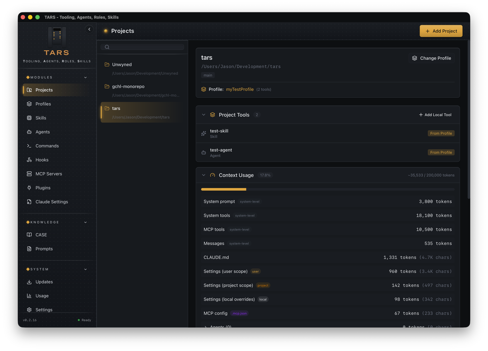
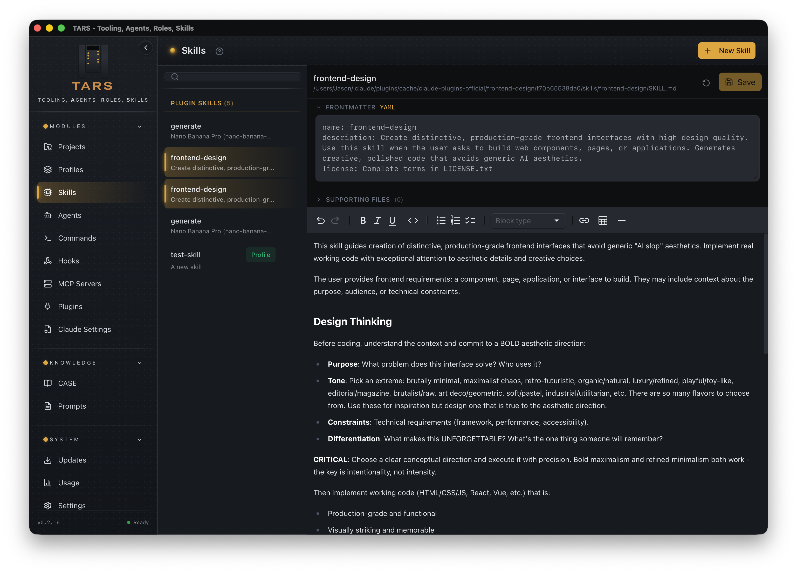
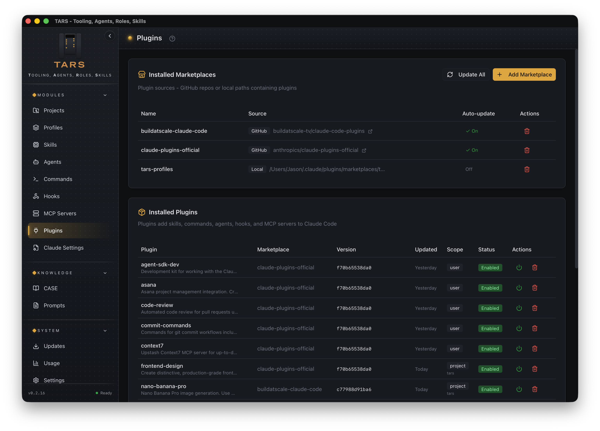

# TARS - Tooling, Agents, Roles, Skills

<p align="center">
  
</p>

<p align="center">
  <strong>A cross-platform desktop application for managing Claude Code configuration across projects</strong>
</p>

<p align="center">
  <a href="https://github.com/inceptyon-labs/TARS/releases/latest"></a>
  <a href="https://github.com/inceptyon-labs/TARS/actions"></a>
  <a href="LICENSE"></a>
  
  <a href="https://github.com/inceptyon-labs/TARS/releases"></a>
</p>

<p align="center">
  <a href="#features">Features</a> •
  <a href="#installation">Installation</a> •
  <a href="#usage">Usage</a> •
  <a href="#architecture">Architecture</a> •
  <a href="#development">Development</a>
</p>

---

## Overview

TARS is a centralized hub for discovering, creating, editing, and managing Claude Code resources. It provides a visual interface for managing skills, agents, commands, hooks, MCP servers, and plugins across multiple projects with safe apply/rollback operations and profile-based configuration sharing via a local profile marketplace.

Inspired by the robot from Interstellar, TARS brings order to your Claude Code configuration chaos.

<p align="center">
  
</p>
<p align="center">
  
  
</p>

## Features

### Project Management
- **Multi-project tracking** - Add and manage multiple projects from a single interface
- **Configuration scanning** - Automatically discover skills, commands, agents, hooks, and MCP servers
- **Collision detection** - Identify configuration conflicts across scopes
- **Context stats** - View token and character usage for project context

### Skills Management
- **Browse & search** - Filter skills by scope (User, Project, Plugin, Managed)
- **Create & edit** - Full markdown editor with YAML frontmatter support
- **Real-time YAML validation** - Inline error highlighting for frontmatter syntax issues
- **Supporting files** - View and manage progressive disclosure files (reference.md, examples.md, scripts/) alongside skills
- **Scope management** - Move skills between user and project scopes
- **Syntax highlighting** - Code blocks with language-specific highlighting

### Agents Management
- **Agent definitions** - Create and edit agent configurations
- **Enable/disable** - Toggle agents on/off without deleting
- **Scope control** - Move agents between configuration scopes
- **Markdown editing** - Rich editor for agent prompts and instructions
- **Real-time YAML validation** - Inline error highlighting for frontmatter syntax issues

### Commands Management
- **Slash commands** - Create custom `/command-name` definitions
- **Template support** - Use `$ARGUMENTS` placeholder for dynamic input
- **Scope hierarchy** - Manage commands at user or project level
- **Real-time YAML validation** - Inline error highlighting for frontmatter syntax issues

### Hooks Configuration
- **Event-driven hooks** - Configure actions for Claude Code events
- **Event types supported**:
  - `PreToolUse` / `PostToolUse` - Before/after tool execution
  - `Stop` - When Claude stops
  - `SessionStart` / `SessionEnd` - Session lifecycle
  - `UserPromptSubmit` - User input handling
  - `PreCompact` - Before context compaction
  - `Notification` - System notifications
  - `SubagentStop` - Subagent completion
- **Hook types** - Command execution or prompt injection
- **Matcher patterns** - Filter which tools/events trigger hooks

### MCP Servers
- **Server management** - Add, remove, and configure MCP servers
- **Transport types** - Support for stdio, HTTP, and SSE
- **Scope configuration** - User, project, and profile scopes
- **Environment variables** - Configure server environment
- **Plugin integration** - View MCP servers provided by installed plugins

### Plugin Management
- **Marketplace support** - Add GitHub, URL, or local marketplace sources
- **Install/uninstall** - Manage plugin lifecycle
- **Scope control** - Install at user, project, or local scope
- **Enable/disable** - Toggle plugins without uninstalling
- **Auto-update** - Configure automatic marketplace updates
- **Cache management** - View and clean plugin cache

### Profiles
Profiles let you create reusable configuration bundles that can be shared across multiple projects. Think of them as "presets" for your Claude Code setup that install as native Claude Code plugins through a local marketplace.

**How It Works**
- Profiles are **plugin drafts** that bundle MCP servers, skills, agents, commands, and hooks
- TARS generates a Claude Code plugin in `~/.tars/profiles/<id>/plugin/`
- The plugin is synced into a local marketplace at `~/.claude/plugins/marketplaces/tars-profiles/`
- When applied, TARS installs `tars-profile-<slug>@tars-profiles` via the Claude CLI
- This provides native plugin management: scope control, enable/disable, clean uninstall
- Tools can be **pinned** (frozen at current version) or **tracked** (detect source changes)

**Creation Wizard**
- **Guided setup** - Step-by-step wizard for creating profiles
- **Multiple source options**:
  - **Single project** - Import tools from one specific project
  - **Registered projects** - Pick tools from projects already added to TARS
- **Development folder** - Scan an entire folder for all Claude-configured projects
- **Start empty** - Create a blank profile and add tools later
- **Tool discovery** - Automatically finds MCP servers, skills, agents, commands, and hooks from project `.claude/` directories and `.mcp.json` files

**Tool Management**
- **Visual tool picker** - Browse and select tools with descriptions and source info
- **Categorized view** - Filter by MCP servers, skills, agents, commands, or hooks
- **Bulk selection** - Select all or clear selections quickly
- **Search** - Find specific tools across all discovered projects
- **Profile scope authoring** - Create tools directly inside a profile from the module editors
- **Source modes**:
  - **Pin** - Freeze tool at current version, ignore source changes
  - **Track** - Detect when source files change, offer updates

**Update Detection**
- **Change detection** - Automatically detect when tracked tool sources change
- **Update indicators** - Visual badges show which tools have updates available
- **Pull updates** - One-click update to sync from source and regenerate plugin
- **Selective updates** - Update individual tools without affecting others

**Profile Application**
- **Apply to Project** - Install as project-scoped plugin from `tars-profiles`
- **Apply to User** - Install as user-scoped plugin from `tars-profiles`
- **Marketplace sync** - Local marketplace and manifest are regenerated on profile changes
- **Native uninstall** - Remove via `claude plugin uninstall`
- **Auto-regeneration** - Plugin automatically regenerates when profile changes

**Import/Export**
- **Plugin export** - Export profiles as Claude Code plugin `.zip` files
- **Legacy import** - Import `.tars-profile.json` profiles from teammates or community
- **Collision handling** - Detect and resolve name conflicts on import

**Safety Features**
- **Atomic updates** - Plugin regeneration uses atomic directory replacement
- **Secure file handling** - Path traversal protection, symlink skipping, depth limits
- **Name sanitization** - Tool names validated for filesystem safety

### Knowledge Center (CASE)
- **Documentation** - Built-in reference for all Claude Code features
- **Searchable** - Quick access to skills, agents, commands, hooks, MCP, and plugin docs
- **External links** - Direct links to official documentation

### Prompts Library
- **Personal storage** - Save prompts and notes (not loaded by Claude)
- **Rich editing** - MDXEditor with full markdown support
- **Code blocks** - Syntax highlighting for 14+ languages
- **Separate storage** - Stored in app data directory, independent of Claude config

### Updates
- **Claude Code updates** - Compare installed vs latest version with update notifications
- **Plugin updates** - Detect available updates for marketplace plugins with version comparison
- **Changelog viewer** - Browse Claude Code release notes with version highlights
- **Automatic polling** - Checks for updates on startup and every 10 minutes
- **Sidebar badge** - Visual indicator showing total update count

### UI Features
- **Theme support** - System, light, and dark modes
- **Collapsible sidebar** - Maximize workspace when needed
- **TARS design system** - Brushed metal aesthetic inspired by Interstellar

## Installation

### Prerequisites

- **Windows**, **macOS**, or **Linux**
- **Rust** 1.75+ with Cargo
- **Bun** (or npm/yarn/pnpm)
- **Claude Code** CLI installed

### Build from Source

```bash
# Clone the repository
git clone https://github.com/jasongoodwin/tars.git
cd tars

# Install frontend dependencies
cd apps/tars-desktop
bun install

# Build the application
bun run tauri build

# The built app will be at:
# Windows: src-tauri/target/release/TARS.exe
# macOS:   src-tauri/target/release/bundle/macos/TARS.app
# Linux:   src-tauri/target/release/tars
```

### Development Mode

```bash
cd apps/tars-desktop
bun install
bun run tauri dev
```

## Usage

### Adding Projects

1. Click **"Add Project"** in the Projects page
2. Select or enter a project directory path
3. TARS will scan for Claude Code configuration files
4. View discovered skills, commands, agents, and hooks in the inventory panel

### Creating Skills

1. Navigate to **Skills** in the sidebar
2. Click **"New Skill"**
3. Choose scope (User or Project)
4. Edit the skill template with your prompt and configuration
5. Save with `Ctrl+S` / `Cmd+S` or click Save

### Managing Profiles

**Creating a Profile:**
1. Go to **Profiles** page and click **"Create Profile"**
2. Enter a name and optional description
3. Choose where to discover tools:
   - **Single project** - Select a specific project folder
   - **Registered projects** - Pick from projects already in TARS
   - **Development folder** - Scan a parent folder (e.g., `~/Development`)
   - **Empty** - Start blank and add tools later
4. Select the MCP servers, skills, agents, commands, and hooks you want in the profile
5. Choose source mode for each tool:
   - **Track** - Follow source changes (default)
   - **Pin** - Freeze at current version
6. Click **"Create Profile"** to save

**Applying to Projects:**
1. Select a profile from the list
2. Click **"Apply to Project"** and select a registered project
3. TARS syncs the local `tars-profiles` marketplace and installs the plugin via CLI
4. The profile's tools are now available as a project-scoped plugin

**Applying Globally:**
1. Select a profile from the list
2. Click **"Apply to User"** to install as a user-scoped plugin
3. The profile's tools are now available across all projects

**Updating Tools:**
1. When tracked tools have source changes, an update badge appears
2. Click the refresh icon to check for updates
3. Click **"Pull"** to sync individual tools from source
4. The plugin automatically regenerates with updated content

**Sharing Profiles:**
1. Select the profile to export
2. Click **"Export Plugin"** and choose a save location
3. Share the `.zip` plugin with teammates
4. They can install it via Claude Code or import a `.tars-profile.json` into TARS

### Configuring Hooks

1. Open **Hooks** page
2. Choose User or Project scope
3. Add hooks for desired events (PreToolUse, Stop, etc.)
4. Configure:
   - **Type**: `command` (shell) or `prompt` (inject text)
   - **Matcher**: Tool/event pattern to match
   - **Timeout**: Max execution time (ms)
5. Save configuration

### Installing Plugins

1. Navigate to **Plugins** page
2. Add marketplace source (if needed):
   - GitHub: `github:owner/repo`
   - URL: `https://example.com/marketplace.json`
   - Local: `/path/to/local/marketplace`
3. Browse available plugins
4. Click **Install** and select scope
5. Enable/disable plugins as needed

## Architecture

```
tars/
├── apps/
│   └── tars-desktop/           # Tauri desktop application
│       ├── src/                # React frontend
│       │   ├── pages/          # Route pages
│       │   ├── components/     # UI components
│       │   ├── lib/            # IPC & utilities
│       │   └── stores/         # Zustand state
│       └── src-tauri/          # Rust backend
│           └── src/commands/   # Tauri commands
│
├── crates/
│   ├── tars-scanner/           # Configuration discovery
│   ├── tars-core/              # Profile engine & operations
│   └── tars-cli/               # CLI wrapper
│
└── Cargo.toml                  # Rust workspace
```

### Configuration Scopes

TARS respects Claude Code's scope hierarchy (highest to lowest precedence):

**macOS:**
1. **Managed** - `/Library/Application Support/ClaudeCode/managed-*.json`
2. **Local** - `<repo>/.claude/settings.local.json`
3. **Project** - `<repo>/.claude/settings.json`, `<repo>/.mcp.json`
4. **User** - `~/.claude/settings.json`, `~/.claude.json`

**Windows:**
1. **Managed** - `%ProgramData%\ClaudeCode\managed-*.json`
2. **Local** - `<repo>\.claude\settings.local.json`
3. **Project** - `<repo>\.claude\settings.json`, `<repo>\.mcp.json`
4. **User** - `%USERPROFILE%\.claude\settings.json`, `%USERPROFILE%\.claude.json`

**Linux:**
1. **Managed** - `/etc/claude-code/managed-*.json`
2. **Local** - `<repo>/.claude/settings.local.json`
3. **Project** - `<repo>/.claude/settings.json`, `<repo>/.mcp.json`
4. **User** - `~/.claude/settings.json`, `~/.claude.json`

### Tech Stack

**Frontend:**
- React 19 + TypeScript 5
- Vite 7
- TanStack Query (server state)
- Zustand (UI state)
- Tailwind CSS + shadcn/ui
- MDXEditor (rich markdown)
- Lucide icons

**Backend:**
- Rust + Tauri 2
- SQLite (embedded database)
- Tokio (async runtime)
- Serde (serialization)
- Gray Matter (frontmatter parsing)

## Development

### Build Commands

```bash
# Rust crates
cargo build                    # Build all crates
cargo test                     # Run tests
cargo clippy --all -- -D warnings  # Lint (must pass)
cargo run -p tars-cli -- scan  # Run scanner CLI

# Frontend
cd apps/tars-desktop
bun run dev                    # Vite dev server only
bun run build                  # Build frontend
bun tsc --noEmit               # Type check
bun run tauri dev              # Full Tauri dev mode
bun run tauri build            # Production build
```

### Project Structure

| Directory | Purpose |
|-----------|---------|
| `apps/tars-desktop/src/pages/` | React route pages |
| `apps/tars-desktop/src/components/` | Reusable UI components |
| `apps/tars-desktop/src/lib/` | IPC wrapper, types, utilities |
| `apps/tars-desktop/src-tauri/src/commands/` | Tauri command handlers |
| `crates/tars-scanner/` | Non-destructive config discovery |
| `crates/tars-core/` | Profile apply, diff, rollback engine |

### File Formats

**Skills/Commands/Agents** use markdown with YAML frontmatter:

```markdown
---
name: my-skill
description: A helpful skill
allowed-tools:
  - Read
  - Write
model: sonnet
---

Your skill prompt here with $ARGUMENTS placeholder.
```

**Settings** use JSON:
- `settings.json` - Permissions, hooks, enabled plugins
- `.mcp.json` - MCP server configurations

## Roadmap

- [x] Cross-platform support (Windows, macOS, Linux)
- [x] Profile sharing via Claude Code plugin format
- [ ] Diff visualization improvements
- [ ] Bulk operations
- [x] Import/export configurations
- [x] Usage analytics dashboard
- [ ] Profile templates gallery
- [ ] Model provider switching (swap API endpoints, keys, and models for OpenAI-compatible LLMs)

## Contributing

Contributions are welcome! Please read the contributing guidelines before submitting PRs.

## Support

If you find TARS useful, consider supporting its development:

[](https://github.com/sponsors/inceptyon-labs)
[](https://ko-fi.com/P5P51QJAJ5)
[](https://etherscan.io/address/0x42353a7Fc70Eab5C0017733813805313B7b10b8B)

## License

MIT License - see [LICENSE](LICENSE) for details.

---

<p align="center">
  <sub>Built with Tauri, React, and Rust</sub>
</p>
